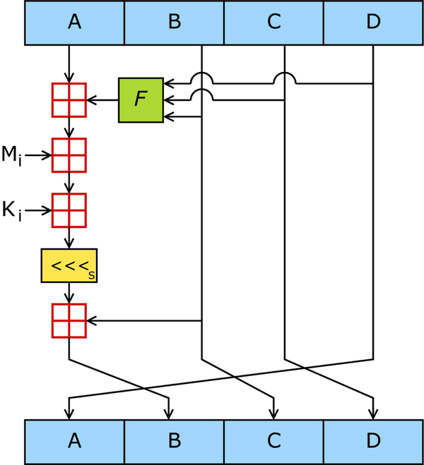

# MD5

MD5 (англ. Message Digest 5) — 128-битный алгоритм хеширования, разработанный профессором Рональдом Л. Ривестом из Массачусетского технологического института (Massachusetts Institute of Technology, MIT) в 1991 году. 
Предназначен для создания «отпечатков» или дайджестов сообщения произвольной длины и последующей проверки их подлинности.
Широко применялся для проверки целостности информации и хранения хешей паролей.

## Алгоритм MD5

На вход алгоритма поступает входной поток данных, хеш которого необходимо найти.\
Длина сообщения измеряется в битах и может быть любой (в том числе нулевой).\
Запишем длину сообщения в `L`.\
Это число целое и неотрицательное.\
Кратность каким-либо числам необязательна.\
После поступления данных идёт процесс подготовки потока к вычислениям.

### Шаги алгоритма

#### Шаг 1. Выравнивание потока
Сначала к концу потока дописывают единичный бит.\
Затем добавляют некоторое число нулевых бит такое, чтобы новая длина потока 
`L′` стала сравнима с `448` по модулю `512`
```
L′=512 × N + 448
```
Выравнивание происходит в любом случае, даже если длина исходного потока уже сравнима с `448`.

#### Шаг 2. Добавление длины сообщения

В конец сообщения дописывают 64-битное представление длины данных (количество бит в сообщении) до выравнивания.\
Сначала записывают младшие 4 байта, затем старшие.\
Если длина превосходит `2^64 − 1`, то дописывают только младшие биты (эквивалентно взятию по модулю `2^64`\
После этого длина потока станет кратной `512`.
Вычисления будут основываться на представлении этого потока данных в виде массива слов по `512` бит.

#### Шаг 3. Инициализация буфера
Для вычислений инициализируются четыре переменные размером по `32` бита, начальные значения которых задаются шестнадцатеричными числами (порядок байтов `little-endian`):
```
А = 01 23 45 67; // 67452301h
В = 89 AB CD EF; // EFCDAB89h
С = FE DC BA 98; // 98BADCFEh
D = 76 54 32 10. // 10325476h
```
В этих переменных будут храниться результаты промежуточных вычислений. Начальное состояние `ABCD` называется инициализирующим вектором.

#### Шаг 4. Вычисление в цикле
Определим функции и константы, которые понадобятся нам для вычислений.

Для каждого раунда потребуется своя функция.\
Введём функции от трёх параметров — слов, результатом также будет слово:
##### 1-й этап:
``` 
FunF(X , Y , Z) = (X ∧ Y) ∨ (¬X ∧ Z)
```
##### 2-й этап: 
```
FunG(X , Y , Z) = (X ∧ Z) ∨ (¬Z ∧ Y)
```
##### 3-й этап: 
```
FunH(X , Y , Z) = X ⊕ Y ⊕ Z
```
##### 4-й этап: 
```
FunI(X , Y , Z) = Y ⊕ (¬Z ∨ X)
```
где `⊕` , `∧` , `∨` , `¬` побитовые логические операции `XOR`, `AND`, `OR` и `NOT` соответственно.

Определим таблицу констант 
T[1 … 64] — 64-элементная таблица данных, построенная следующим образом: 
```
T[n]= int(2^32 * |sin(n)|)
```

Каждый 512-битный блок проходит 4 этапа вычислений по 16 раундов.\
Для этого блок представляется в виде массива X из 16 слов по 32 бита.\
Все раунды однотипны и имеют вид: `[abcd k s i]`, определяемый как 
```
a = b + ((a + Fun(b , c , d) + X[k] + T[i]) ⋘ s)
```
`k` — номер 32-битного слова из текущего 512-битного блока сообщения.\
`… ⋘ s` — циклический сдвиг влево на s бит полученного 32-битного аргумента.\
Число `s` задается отдельно для каждого раунда.

Заносим в блок данных элемент `n` из массива 512-битных блоков.
Сохраняются значения `A`, `B`, `C` и `D`, оставшиеся после операций над предыдущими блоками (или их начальные значения, если блок первый).
```
AA = A
BB = B
CC = C
DD = D
```
##### Этап 1
```
/* [abcd k s i] a = b + ((a + F(b,c,d) + X[k] + T[i]) <<< s). */
[ABCD  0 7  1][DABC  1 12  2][CDAB  2 17  3][BCDA  3 22  4]
[ABCD  4 7  5][DABC  5 12  6][CDAB  6 17  7][BCDA  7 22  8]
[ABCD  8 7  9][DABC  9 12 10][CDAB 10 17 11][BCDA 11 22 12]
[ABCD 12 7 13][DABC 13 12 14][CDAB 14 17 15][BCDA 15 22 16]
```
##### Этап 2
```
/* [abcd k s i] a = b + ((a + G(b,c,d) + X[k] + T[i]) <<< s). */
[ABCD  1 5 17][DABC  6 9 18][CDAB 11 14 19][BCDA  0 20 20]
[ABCD  5 5 21][DABC 10 9 22][CDAB 15 14 23][BCDA  4 20 24]
[ABCD  9 5 25][DABC 14 9 26][CDAB  3 14 27][BCDA  8 20 28]
[ABCD 13 5 29][DABC  2 9 30][CDAB  7 14 31][BCDA 12 20 32]
```
##### Этап 3
```
/* [abcd k s i] a = b + ((a + H(b,c,d) + X[k] + T[i]) <<< s). */
[ABCD  5 4 33][DABC  8 11 34][CDAB 11 16 35][BCDA 14 23 36]
[ABCD  1 4 37][DABC  4 11 38][CDAB  7 16 39][BCDA 10 23 40]
[ABCD 13 4 41][DABC  0 11 42][CDAB  3 16 43][BCDA  6 23 44]
[ABCD  9 4 45][DABC 12 11 46][CDAB 15 16 47][BCDA  2 23 48]
```
##### Этап 4
```
/* [abcd k s i] a = b + ((a + I(b,c,d) + X[k] + T[i]) <<< s). */
[ABCD  0 6 49][DABC  7 10 50][CDAB 14 15 51][BCDA  5 21 52]
[ABCD 12 6 53][DABC  3 10 54][CDAB 10 15 55][BCDA  1 21 56]
[ABCD  8 6 57][DABC 15 10 58][CDAB  6 15 59][BCDA 13 21 60]
[ABCD  4 6 61][DABC 11 10 62][CDAB  2 15 63][BCDA  9 21 64]
```
Суммируем с результатом предыдущего цикла:
```
A = AA + A
B = BB + B
C = CC + C
D = DD + D
```
После окончания цикла необходимо проверить, есть ли ещё блоки для вычислений. 
Если да, то переходим к следующему элементу массива `(n + 1)` и повторяем цикл.

#### Шаг 5. Результат вычислений
Результат вычислений находится в буфере `ABCD`, это и есть хеш. 
Если выводить побайтово, начиная с младшего байта `A` и заканчивая старшим байтом `D`, то мы получим MD5-хеш.

### Схема работы алгоритма MD5.
\
`F` — нелинейная функция.\
`M_i` обозначает 32-битный блок входного сообщения, а `K_i` — 32-битную константу.\
`<<<s` обозначает циклический сдвиг влево на `s` бит.\

`⊞` - обозначает сложение по модулю `2^32`.\
`F` зависит от раунда.\
`K_i` и `s` меняются каждую операцию.

## Материалы 

Статья в википедии [MD5](https://ru.wikipedia.org/wiki/MD5)